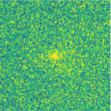
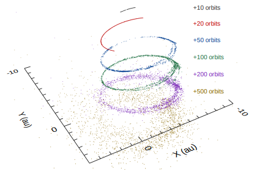

## Hi there!

I am an astronomer at the [University of Maryland](http://www.umd.edu/). Currently I am also a long-term visitor at [Boston University](http://www.bu.edu).

I am primarily interested in the small bodies of the Solar System -- asteroids, comets, and meteoroids. These objects are pristine remnants from the early times of Solar System and can help us understand planetary formation, migration, and evolution. Studying these objects can also helps us understand the origins of life on Earth as well as the threat they might pose to Earth. Additionally, they offer a window into the broader context of planetary systems beyond our own. 

I use a wide range of techniques to study these objects, from ground-based and space-based telescopes in ultraviolet, optical, infrared, and radio wavelengths, to wide-field cameras and radars that capture the light and debris of meteors, and to large-scale numerical simulations running on supercomputers. I am also a member of the [NASA Planetary Data System Small Bodies Node](https://pds-smallbodies.astro.umd.edu/).

I was captivated by the stars when I was a child. I still enjoy going out for (non-work-related) stargazing every once in a while. Besides stars, I also have a passion for music. I have played violin, viola and cello in various orchestras and string ensembles as I move from China to Canada and then the US. Most recently, I played viola and cello in Caltech's wonderful [Chamber Music program](http://chambermusic.caltech.edu/).

[How to pronounce my name?](#my-name)

 
* * *

## Education

* Ph.D. in Astronomy, [University of Western Ontario](http://www.uwo.ca/), 2016
    * Advisor: [Peter Brown](http://meteor.uwo.ca/~pbrown/)
    * Thesis: [Aging Comets and Their Meteor Showers](http://ir.lib.uwo.ca/etd/3903/)
* M.Sc. in Astronomy, [University of Western Ontario](http://www.uwo.ca/), 2013
* B.Sc. in Atmospheric Sciences, [Sun Yat-sen University](http://www.sysu.edu.cn/), 2010

 
* * *

## Professional Appointments

* Assistant Research Scientist, [Department of Astronomy](https://www.astro.umd.edu), [University of Maryland](http://www.umd.edu), 2019 - present
* Visiting Researcher, [Center for Space Physics](https://www.bu.edu/csp/), [Boston University](https://www.bu.edu/), 2022 - present
* Postdoctoral Scholar, [Caltech](http://www.caltech.edu/)/[IPAC](http://www.ipac.caltech.edu/), 2016 - 2019
* Graduate Teaching/Research Assistant, [Department of Physics and Astronomy](https://physics.uwo.ca), [University of Western Ontario](http://www.uwo.ca/), 2011 - 2016
* Research Fellow, Atmospheric Exploration Laboratory, [Sun Yat-sen University](http://www.sysu.edu.cn/), 2007 - 2011

 
* * *

## Honors and Awards

* 2023 [Harold C. Urey Prize in Planetary Science](https://dps.aas.org/prizes/urey)
* 2022 NASA Silver Group Award (Planetary Data System Team)
* 2017 Minor planet [(10280) Yequanzhi](https://ssd.jpl.nasa.gov/sbdb.cgi?sstr=10280;old=0;orb=1;cov=0;log=0;cad=0#orb)
* 2007 China Youth Science and Technology Innovation Award

 
* * *

## Research

The keyword cloud above is generated using [Scimeter](https://scimeter.org/). You can find a list of my publication on [NASA/ADS](https://ui.adsabs.harvard.edu/public-libraries/uWrrUyxARqG0pdFiOw3adg) or [Google Scholar](https://scholar.google.com/citations?user=do9dkJYAAAAJ).

 
### Latest Research

Jupiter-family comet P/2021 HS (PANSTARRS) only exhibits a coma a few weeks of its perihelion passage at 0.8 astronomical units, which is atypical for a comet. Did it undergo a brief outburst that coincides with the perihelion, or does it have an activity mechanism that somehow only operate relatively close to the Sun? Neither. We find that the detection of the activity is caused by an extremely faint coma being enhanced by the forward scattering effect owing to the comet reaching a fortuitous spot -- almost right between the Sun and the Earth. As a result, it becomes one of the few most weakly active comets ever detected. By combining its measured physical and dynamical properties, we speculate that it probably had been in the inner Solar System for quite a while.

[Ye, Kelley, Bauer et al. (2023), PSJ, 4, 47](https://iopscience.iop.org/article/10.3847/PSJ/acbfbb)

 

What do you want to know about the relationship between comets and meteor showers? In this review article, we talk about the development and current state of affairs of meteor science -- with a focus on its role as a tool to study comets. We also review the established parent body -- meteor shower linkages.

[Ye and Jenniskens (2023), Comets III, in press](https://arxiv.org/abs/2209.10654)

 

Comet C/2019 Y4 (ATLAS) generated quite a bit of excitement when it once held the potential to be the "Comet of the Century" but eventually disrupted two months before reaching perihelion. Despite so, it is still an exciting object as it is the first member of a long-period comet group observed to disintegrate well before perihelion. We used the mighty [Hubble Space Telescope](https://www.nasa.gov/mission_pages/hubble/main/index.html) to observe the comet as it fell apart and found direct evidence of a non-uniform nucleus: one part of the comet is more fragile than the other; and additionally, the comet supposedly passed extremely close to the Sun during its last return but failed more than 4 times farther away from the Sun this time, which is very intriguing. In an earlier work, we discussed and confirmed the sibling relationship of C/2019 Y4 and a bright comet that appeared in the year of 1844.

[Ye, Jewitt, Hui et al. (2021), AJ, in press](https://arxiv.org/abs/2105.02269) .. [Hui and Ye (2020), AJ, 160, 91](https://iopscience.iop.org/article/10.3847/1538-3881/ab9d81/meta)

 

(3200) Phaethon is a mysterious object: it is associated with the strong Geminid meteor shower, implying that it had been highly active in the past, yet decades of observation showed that it is largely inactive. Using the mighty [Lowell Discovery Telescope](https://lowell.edu/research/research-facilities/4-3-meter-ldt/), we conducted one of the deepest searches for signs of Phaethon's activity. Although we did not find anything, we placed a stringent constraint on the upper limit of Phaethon's activity, which may help the forthcoming [DESTINY+ mission](https://destiny.isas.jaxa.jp/), set to launch to Phaethon in 2028. In a different paper, we also used the Hubble Space Telescope to search for small fragments recently ejected from Phaethon.

[Ye, Knight, Kelley et al. (2021), PSJ, 2, 23](https://iopscience.iop.org/article/10.3847/PSJ/abcc71) .. [Ye, Wiegert and Hui (2018), ApJL, 864, 9](http://iopscience.iop.org/article/10.3847/2041-8213/aada46/meta)

 

"Don't aim your telescope near the Sun," they say, but at Zwicky Transient Facility we gave it a try. Not during daytime of course, but during the brief twilight hours. The goal? Explore the innermost region in the solar system. By going about 10 degrees closer to the Sun than other surveys (and, of course, have to endure brighter background and sub-par image quality), we have increased the number of known Atiras -- the asteroids whose orbits are entirely confined within Earth's orbit -- by 30 per-cent. Our discoveries include (594913) ꞌAylóꞌchaxnim, the first (and so far the only) asteroid discovered to have an orbit completely within Venus's orbit.

[Ip, Masci, Ye et al. (2022), ApJL, 935, 6](https://iopscience.iop.org/article/10.3847/2041-8213/ac8470) .. [Ye, Masci, Ip et al. (2020), AJ, 159, 70](https://iopscience.iop.org/article/10.3847/1538-3881/ab629c)

* * *

## Outreach

I enjoy talking to the public about my research. I have written over 50 articles for popular science and have given over 80 public talks since 2004. Most of my outreach work was done in China and/or in Chinese/Mandarin. But whenever I got a chance, I make an effort of going out of my comfort zone and speak to the audience/journalists in the US!

Some of my recent outreach work in English:

* [Guest blogs at the Planetary Society, introducing recent Chinese space activities to the West](http://www.planetary.org/blogs/guest-blogs/?author_profile=325290428&topics=&dateType=firstPublicationDate&startDate=&endDate=)
* Appearance on [Spacepod #103: meteor showers and "broom stars" with Dr. Ye](https://www.listentospacepod.com/episodes/2017/7/16/103-meteor-showers-and-broom-stars-with-dr-ye)
* Appearance on [Astrotalk UK #75: China - back to the Moon with Chang'e 4](https://astrotalkuk.org/episode-75-china-back-to-the-moon-with-chang-e-4/)
    
If you are curious, here are some of my Mandarin-speaking podcasts:

* [Mountain Star Talk Show #194: Geminid meteor shower](https://player.fm/series/series-106962/no194)
* [Mountain Star Talk Show #196: interstellar asteroid 'Oumuamua](https://player.fm/series/series-106962/no196-oumuamua)
* [Astronomy on Tap (Mandarin) #1: Killer asteroids](https://www.caltech.edu/campus-life-events/master-calendar/astronomy-on-tap-90098)

You can find me on [Twitter](https://twitter.com/Yeqzids) or [Weibo](https://www.weibo.com/1705147594) (Twitter-like service in China).

 
* * *

## Tools

* [MPEC Watch](https://sbnmpc.astro.umd.edu/mpecwatch/) -- statistical metrics and plots derived from Minor Planet Center's Minor Planet Electronic Circular service.
* [MPC Asteroid Name/Citation Search](https://sbnmpc.astro.umd.edu/mpcitations/index.shtml) -- a simple tool to search the naming citations of named minor planets.
* [7Timer!](https://www.7timer.info) -- a service that provides astronomy-oriented weather forecast for the next a couple of days.

 
### My Name

> The most accurate pronounciation of my name is **Yeh Ch'üan Chih**, but I wouldn't mind if you want to call me Ch'üan Chih, Qwuaan-Zee, or just simply "QZ". Note that in the Chinese naming convention, the surname typically comes before the given name, therefore "Ye" is my surname and "Quanzhi" is my given name, though in publications I usually follow the Western convention and list my name is Quanzhi Ye.

> Chinese names often carry special meanings. "Ye" (叶 in simplified Chinese, 葉 in traditional Chinese) means "leaf" in Chinese. Ye is also romanized "Yeh", "Yip", "Ip" in different spelling systems and variety of spoken Chinese (e.g. Cantonese), and "She" in ancient Chinese. The surname originated as a clan name after the [Duke of Ye](https://en.wikipedia.org/wiki/Duke_of_Ye), the Prime Minister of the [State of Chu](https://en.wikipedia.org/wiki/Chu_(state)) in the 5th century BC. Confucius visited the Duke of Ye (She) in 489 BCE, and their conversations were recorded in [The Analects](https://ctext.org/analects/zi-lu). "Quan"/泉 means spring (source of water), and "Zhi"/志 means aspiration, so my given name means something along the lines of a source of ample aspiration that runs like spring water, with reference to my surname since leaves need water.

###### Last update: 2023 August 13
