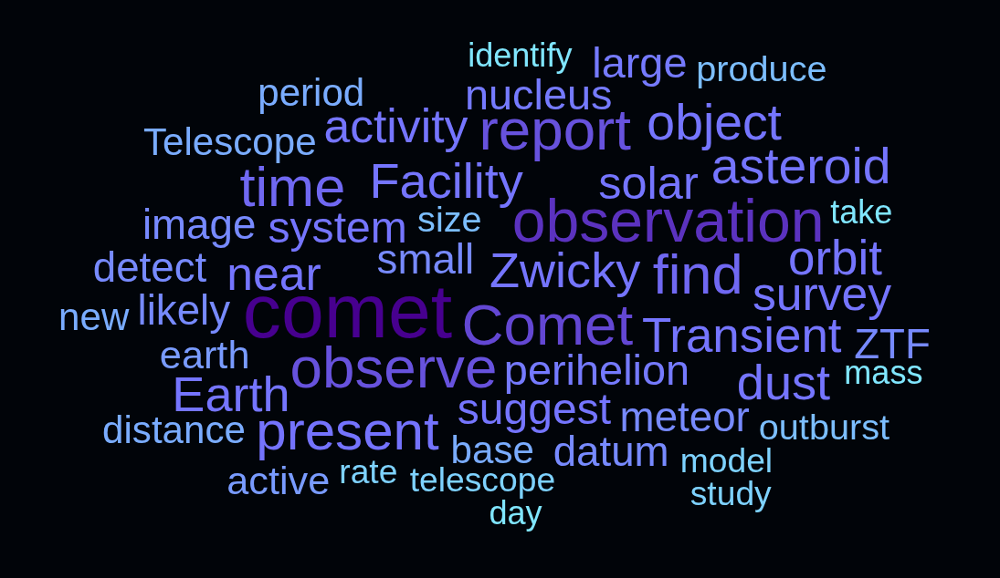
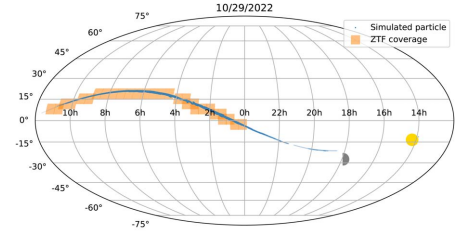
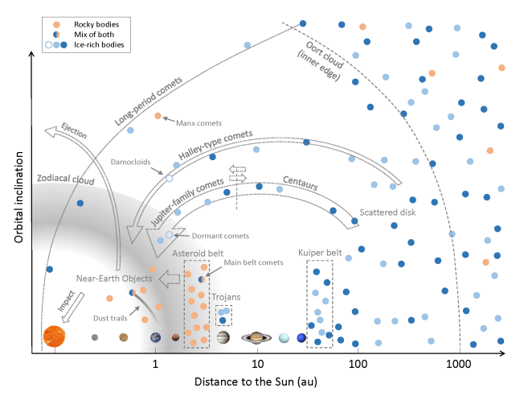
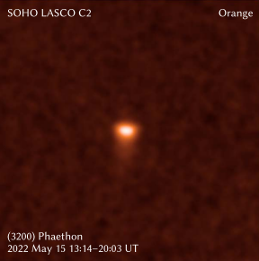

## Hi! I am Quanzhi (Ch'üan Chih).

I am a research faculty at the [Department of Astronomy](https://www.astro.umd.edu) of [University of Maryland](http://www.umd.edu/). Currently I live in the Boston area and am also a long-term visitor at the [Center for Space Physics](https://www.bu.edu/csp/) of [Boston University](http://www.bu.edu).

I am primarily interested in the small bodies of the Solar System -- asteroids, comets, and meteoroids. These objects are pristine remnants from the early times of Solar System and can help us understand planetary formation, migration, and evolution. Studying these objects can also helps us understand the origins of life on Earth as well as the threat they might pose to Earth. Additionally, they offer a window into the broader context of planetary systems beyond our own. 

I use a wide range of techniques to study these objects, from ground-based and space-based telescopes in ultraviolet, optical, infrared, and radio wavelengths, to wide-field cameras and radars that capture the light and debris of meteors, and to large-scale numerical simulations running on supercomputers. Most recently, I have been working on the data obtained by the [Zwicky Transient Facility](https://www.ztf.caltech.edu/) to study asteroids and comets in our cosmic neighborhood. I am also a member of the [NASA Planetary Data System Small Bodies Node](https://pds-smallbodies.astro.umd.edu/), helping on archiving and curating the data obtained by various near-Earth object surveys as well as the Minor Planet Center.

I was captivated by the stars when I was a child. I still enjoy going out for (non-work-related) stargazing every once in a while. Besides stars, I also have a passion for music. I have played violin, viola and cello in various orchestras and string ensembles as I move from China to Canada and then the US. Most recently, I played viola and cello in Caltech's wonderful [Chamber Music program](http://chambermusic.caltech.edu/).

[What's in my name?](#my-name)

 
* * *

## Education

* Ph.D. in Astronomy, [University of Western Ontario](http://www.uwo.ca/), 2016
    * Advisor: [Peter Brown](http://meteor.uwo.ca/~pbrown/)
    * Thesis: [Aging Comets and Their Meteor Showers](http://ir.lib.uwo.ca/etd/3903/)
* M.Sc. in Astronomy, [University of Western Ontario](http://www.uwo.ca/), 2013
* B.Sc. in Atmospheric Sciences, [Sun Yat-sen University](http://www.sysu.edu.cn/), 2010

 
* * *

## Professional Appointments

* Research Scientist, [Department of Astronomy](https://www.astro.umd.edu), [University of Maryland](http://www.umd.edu), 2019 - 2024 (Assistant); 2024 - present (Associate)
* Visiting Researcher, [Center for Space Physics](https://www.bu.edu/csp/), [Boston University](https://www.bu.edu/), 2022 - present
* Postdoctoral Scholar, [Caltech](http://www.caltech.edu/)/[IPAC](http://www.ipac.caltech.edu/), 2016 - 2019

 
* * *

## Honors and Awards

* 2023 [Harold C. Urey Prize in Planetary Science](https://dps.aas.org/prizes/urey)
* 2017 Minor planet [(10280) Yequanzhi](https://ssd.jpl.nasa.gov/sbdb.cgi?sstr=10280;old=0;orb=1;cov=0;log=0;cad=0#orb)
* 2007 Youth Science and Technology Innovation Award (China)

 
* * *

## Research

<object data="imgs/wordcloud.svg" type="image/svg+xml">
  
</object>

Keyword cloud generated using [NASA/ADS](https://ui.adsabs.harvard.edu/public-libraries/uWrrUyxARqG0pdFiOw3adg). For a list of my publications, please see [NASA/ADS](https://ui.adsabs.harvard.edu/public-libraries/uWrrUyxARqG0pdFiOw3adg) or [Google Scholar](https://scholar.google.com/citations?user=do9dkJYAAAAJ).

 
### Latest Research

The Encke-Taurid Complex, comprising of Encke's Comet and the Taurid meteoroid stream, is thought to be the relics of a large-scale cometary breakup and may harbor a swarm of potentially Earth-threatening asteroids. The existence of this swarm, however, is uncertain due to the lack of observations. We used the mighty [Zwicky Transient Facility](https://www.ztf.caltech.edu/) to conduct a targeted search of such asteroids during their predicted close encounter to Earth in 2022. The analysis, led by Poolesville High School student Jasmine Li, showed that there are no more than 9 to 14 hundred-meter-class asteroids in this swarm, suggesting that the impact risk from these asteroids is relatively low and that Encke's Comet's progenitor was about 10 km in size, smaller than some earlier estimates.

[Li, Ye, Vida et al. (2025), PSJ, 6, 94](https://iopscience.iop.org/article/10.3847/PSJ/adbe74) .. [Press Release](https://cmns.umd.edu/news-events/news/new-study-eases-concerns-over-possible-doomsday-asteroid-swarm)

 

This chapter, entitled ``Minor planets, asteroids, comets and interplanetary dust within 30 au'', provides an up-to-date (as of late 2024) review of the research of small Solar System bodies (including meteoroids and interplanetary dust) within roughly the orbit of Neptune. The chapter is part of the <i>Encyclopedia of Astrophysics, 1st Edition</i> which aims to provide the first entry point for undergraduate and graduate students as well as early career researchers to the field. I try to include as much as nice and useful figures as I could!

[Ye (2025), Encyclopedia of Astrophysics (in press)](https://shop.elsevier.com/books/encyclopedia-of-astrophysics/mandel/978-0-443-21439-4) | [preprint](https://arxiv.org/pdf/2409.09540)

 

What do you want to know about the relationship between comets and meteor showers? In this review article, we talk about the development and current state of affairs of meteor science -- with a focus on its role as a tool to study comets. We also review the established parent body -- meteor shower linkages.

[Ye and Jenniskens (2024), Comets III, p. 799](https://uapress.arizona.edu/book/comets-iii) | [preprint](https://arxiv.org/abs/2209.10654)

 

Comet C/2019 Y4 (ATLAS) generated quite a bit of excitement when it once held the potential to be the "Comet of the Century" but eventually disrupted two months before reaching perihelion. Despite so, it is still an exciting object as it is the first member of a long-period comet group observed to disintegrate well before perihelion. We used the mighty [Hubble Space Telescope](https://www.nasa.gov/mission_pages/hubble/main/index.html) to observe the comet as it fell apart and found direct evidence of a non-uniform nucleus: one part of the comet is more fragile than the other; and additionally, the comet supposedly passed extremely close to the Sun during its last return but failed more than 4 times farther away from the Sun this time, which is very intriguing. In an earlier work, we discussed and confirmed the sibling relationship of C/2019 Y4 and a bright comet that appeared in the year of 1844.

[Ye, Jewitt, Hui et al. (2021), AJ, 162, 70](https://iopscience.iop.org/article/10.3847/1538-3881/abfec3) .. [Hui and Ye (2020), AJ, 160, 91](https://iopscience.iop.org/article/10.3847/1538-3881/ab9d81/meta)

 

(3200) Phaethon is a mysterious object: it is associated with the strong Geminid meteor shower, implying that it had been highly active in the past, yet decades of observation showed that it is largely inactive. Lead by my colleague [Qicheng Zhang](https://near.earth/qz/), we analyze 25 years of data collected by the Solar and Heliospheric Observatory (SOHO), a veteran spacecraft that can observe the near-Sun sky, and find that Phaethon's near-Sun activity is actually caused by sodium emission. In separate works, we used the mighty [Lowell Discovery Telescope](https://lowell.edu/research/research-facilities/4-3-meter-ldt/) to conduct one of the deepest searches for signs of Phaethon's activity as well as the Hubble Space Telescope to search for small fragments recently ejected from Phaethon.

[Zhang, Battams, Ye et al. (2023), PSJ, 4, 70](https://iopscience.iop.org/article/10.3847/PSJ/acc866) .. [Ye, Knight, Kelley et al. (2021), PSJ, 2, 23](https://iopscience.iop.org/article/10.3847/PSJ/abcc71) .. [Ye, Wiegert and Hui (2018), ApJL, 864, 9](http://iopscience.iop.org/article/10.3847/2041-8213/aada46/meta)

* * *

## Outreach

I enjoy talking to the media and public about my research and have been frequently doing so in both Mandarin Chinese and English.

Some of my recent outreach works in English:

* [Guest blogs at the Planetary Society, introducing recent Chinese space activities to the West](http://www.planetary.org/blogs/guest-blogs/?author_profile=325290428&topics=&dateType=firstPublicationDate&startDate=&endDate=)
* Appearance on [Spacepod #103: meteor showers and "broom stars" with Dr. Ye](https://www.listentospacepod.com/episodes/2017/7/16/103-meteor-showers-and-broom-stars-with-dr-ye)
* Appearance on [Astrotalk UK #75: China - back to the Moon with Chang'e 4](https://astrotalkuk.org/episode-75-china-back-to-the-moon-with-chang-e-4/)
    
...and in Mandarin Chinese:

* [Mountain Star Talk Show #194: Geminid meteor shower](https://player.fm/series/series-106962/no194)
* [Mountain Star Talk Show #196: interstellar asteroid 'Oumuamua](https://player.fm/series/series-106962/no196-oumuamua)
* [Los Angeles Astronomy on Tap #65: Killer asteroids](https://youtu.be/Lne2-5EW7dI)

 
* * *

## Tools

* [MPEC Watch](https://sbnmpc.astro.umd.edu/mpecwatch/) -- statistical metrics and plots derived from Minor Planet Center's Minor Planet Electronic Circular service.
* [MPC Asteroid Name/Citation Search](https://sbnmpc.astro.umd.edu/mpcitations/index.shtml) -- a simple tool to search the naming citations of named minor planets.
* [7Timer!](https://www.7timer.info) -- a service that provides astronomy-oriented weather forecast for the next a couple of days.

 
### My Name

> The most accurate pronunciation of my name is **Yeh Ch'üan Chih**, but I wouldn't mind if you want to call me Ch'üan Chih, Qwuaan-Zee, or just simply "QZ". Note that in the Chinese naming convention, the surname typically comes before the given name, therefore "Ye" is my surname and "Quanzhi" is my given name, though in publications I usually follow the Western convention and list my name is Quanzhi Ye.

> Chinese names often carry special meanings. "Ye" (叶 in simplified Chinese, 葉 in traditional Chinese) means "leaf" in Chinese. Ye is also romanized "Yeh", "Yip", "Ip" in different spelling systems and variety of spoken Chinese (e.g. Cantonese), and "She" in ancient Chinese. The surname originated as a clan name after the [Duke of Ye](https://en.wikipedia.org/wiki/Duke_of_Ye), the Prime Minister of the [State of Chu](https://en.wikipedia.org/wiki/Chu_(state)) in the 5th century BC. Confucius visited the Duke of Ye (She) in 489 BC, and their conversations were recorded in [The Analects](https://ctext.org/analects/zi-lu). "Quan"/泉 means spring (source of water), and "Zhi"/志 means aspiration, so my given name means something along the lines of a source of ample aspiration that runs like spring water, with reference to my surname since leaves need water.

###### Last update: 2025 June 7
