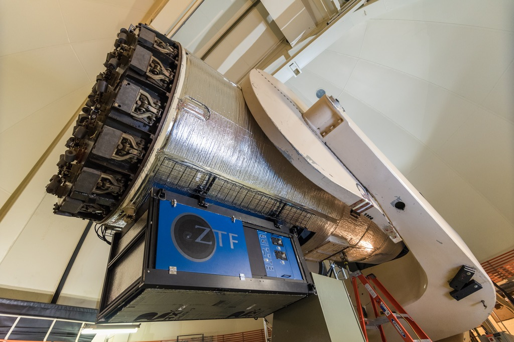

## Hi there!

### My name is Quanzhi, you can call me QZ. I am an astronomer at [Caltech](http://www.caltech.edu/)/[IPAC](http://www.ipac.caltech.edu/). I am mostly interested in small bodies in the Solar System -- namely asteroids, comets and meteoroids.

For the most part of my current work, I use the data collected by the [Zwicky Transient Facility (ZTF) project](https://www.ztf.caltech.edu/) at [Palomar Observatory](http://www.astro.caltech.edu/palomar/homepage.html) to discover and characterize near-Earth asteroids, and to understand why and how comets get activated. I also use a range of worldwide facilities provided by the [GROWTH consortium](http://growth.caltech.edu/) to study these intriguing objects.

I was lured into astronomy by stars when I was a kid. Nowadays I still enjoy going out for stargazing in my spare time. I also have a passion for classical music and play viola and cello at Caltech's [Chamber Music program](http://chambermusic.caltech.edu/).

###### Photo by Hung-Chin Lin

 
* * *

## Education

* Ph.D. in Astronomy, [University of Western Ontario](http://www.uwo.ca/), 2016
    * Advisor: [Peter Brown](http://meteor.uwo.ca/~pbrown/)
    * Thesis: [Aging Comets and Their Meteor Showers](http://ir.lib.uwo.ca/etd/3903/)
* M.Sc. in Astronomy, [University of Western Ontario](http://www.uwo.ca/), 2013
* B.Sc. in Atmospheric Sciences, [Sun Yat-sen University](http://www.sysu.edu.cn/), 2010

 
* * *

## Professional Appointments

* Postdoctoral Scholar in Astronomy, [Caltech](http://www.caltech.edu/), 2016 - present
* Long-term Visitor, [Caltech/IPAC](http://www.ipac.caltech.edu/), 2016 - present
* Graduate Teaching/Research Assistant, [University of Western Ontario](http://www.uwo.ca/), 2011 - 2016
* Research Fellow, [Sun Yat-sen University](http://www.sysu.edu.cn/) Atmospheric Exploration Laboratory, 2007 - 2011

 
* * *

## Research

The keyword cloud above is generated using [Scimeter](https://scimeter.org/). You can find a list of my publication on [NASA/ADS](https://ui.adsabs.harvard.edu/search/__qid=124fd9103d907ddc8650fd418a589a8a&q=*%3A*&sort=date%20desc%2C%20bibcode%20desc) or [Google Scholar](https://scholar.google.com/citations?hl=en&user=q0EQUHQAAAAJ).

 
### Latest Research

(6478) Gault, a main-belt asteroid, suddenly sprouted two tails in late 2018 to early 2019. Of course we immediately went into action! Using ZTF data we were able to determine the exact date of the onset of the activity as well as the amount and properties of material that it released (make sure you check out the time lapse of Gault made using ZTF data). Based on available evidence, we concluded that the activity of Gault was probably caused by rotational instability or binary merging -- that is, either Gault was spinning so fast that dust on its surface was thrown into space, or Gault had two components that were rubbing against each other.

[Ye, Kelley, Bodewits et al. (2019), ApJL, 874, 16](https://iopscience.iop.org/journal/1538-3873/page/Zwicky-Transient-Facility)

 

What happen to the asteroids that get too close to the Sun? Previously studies suggest that they explode -- but we don't know what such explosion looks like, because we have never seen one until now. But there are other ways to probe this process: the ill-fated asteroids produce dust streams on their orbits that, if they intersect Earth's orbit, could be visible as meteor showers. Here we use dynamical model and meteor observations to understand the explosion of near-Sun asteroids. We find that such "explosions" probably happen in slow-motion -- they may take a few thousand years to complete. We also made an educated guess that some of the near-Sun "comets" might in fact be exploding (or, to use a better word, "disintegrating") asteroids.

[Ye and Granvik (2019), ApJ, 873, 104.](https://iopscience.iop.org/article/10.3847/1538-4357/ab05ba/meta)

 

A ZTF paper party! Here you will find all you need to know about ZTF: telescope, camera, data processing, survey strategy, as well as preliminary science results. For asteroid enthusiasts we have two back-to-back papers (on different journals though) describing our ongoing effort of detecting fast-moving objects (FMOs) using ZTF.

[PASP: ZTF Special Issue](https://iopscience.iop.org/journal/1538-3873/page/Zwicky-Transient-Facility) | [Ye, Masci, Lin et al. (2019), PASP in press.](https://arxiv.org/abs/1904.09645) | [Duev, Mahabal, Ye et al. (2019), MNRAS, 486, 4158.](https://academic.oup.com/mnras/article-abstract/486/3/4158/5472913?redirectedFrom=fulltext)

 

Near-Earth Asteroid (3200) Phaethon is a mysterious object: it is associated with the strong Geminid meteor shower, implying that it had been highly active in the past, yet decades of observation showed that it is largely inactive. We used the Hubble Space Telescope to search for small fragments recently ejected from Phaethon. Although we found nothing, we concluded that Phaethon has likely not been very active in the recent decades. We also showed how to take an ugly photo with Hubble!

[Ye, Wiegert and Hui (2018), ApJL, 864, 9.](http://iopscience.iop.org/article/10.3847/2041-8213/aada46/meta)

 

We target a 250-year-old unresolved mystery! Lexell's Comet was found in 1770 and was then subsequently lost, where could it be? We used a wide range of 21th century techniques -- state-of-the-art orbit determination, computer simulation, as well as modern day astronomical observation to try to solve this puzzle. Well, even though we still don't know where Lexell's Comet is, we uncovered a number of interesting clues that help you decide how to put your money (in case you want to bet). Bottom line: this could be one of the largest Near-Earth Objects that we know, and chances are good that it is still around!

[Ye, Wiegert and Hui (2018), AJ, 155, 163.](http://iopscience.iop.org/article/10.3847/1538-3881/aab1f6/meta). See also: [AAS Nova post](https://aasnova.org/2018/08/22/has-anyone-found-a-lost-comet/); [astrobites post](https://astrobites.org/2018/04/02/long-lost-comet/)

 
* * *

## Outreach

In addition to research, I also love doing outreach. I have written many articles for magazines/blogs and have delivered about 80 presentations since 2004. Most of my outreach work was done in my home country (China). Unsurprisingly, I find doing outreach in western countries hugely different from what I have done in China! But I have since found my niche on promoting the communication between China and the West.

Some of my recent outreach works with connection to English-speaking audience:

* [Guest blogs at the Planetary Society, introducing recent Chinese space activities to the West](http://www.planetary.org/blogs/guest-blogs/?author_profile=325290428&topics=&dateType=firstPublicationDate&startDate=&endDate=)
* Appearance on [Spacepod #103: meteor showers and "broom stars" with Dr. Ye](https://www.listentospacepod.com/episodes/2017/7/16/103-meteor-showers-and-broom-stars-with-dr-ye)
* Appearance on [Astrotalk UK #75: China - back to the Moon with Chang'e 4](https://astrotalkuk.org/episode-75-china-back-to-the-moon-with-chang-e-4/)
    
If you are curious, here are some Mandarin-speaking podcasts that I have contributed:

* [Mountain Star Talk Show #194: Geminid meteor shower](https://player.fm/series/series-106962/no194)
* [Mountain Star Talk Show #196: interstellar asteroid 'Oumuamua](https://player.fm/series/series-106962/no196-oumuamua)

You can find me on [Twitter](https://twitter.com/Yeqzids) or [Weibo](https://www.weibo.com/1705147594) (Twitter-like service in China).

 
* * *

## Miscellaneous

* I am honored to receive the naming of asteroid [(10280) Yequanzhi](https://ssd.jpl.nasa.gov/sbdb.cgi?sstr=10280;old=0;orb=1;cov=0;log=0;cad=0#orb), courtesy of [Bobby Bus](https://www.ifa.hawaii.edu/users/sjb/default/bus.shtml).
* I was fortunate to have co-discovered [comet C/2007 N3 (Lulin)](https://en.wikipedia.org/wiki/Comet_Lulin), the naked-eye comet in 2009, with acclaimed Taiwanese astrophotographer Chi Sheng Lin: [Spaceweather.com gallery](http://www.spaceweather.com/comets/gallery_lulin.htm).
* [Research webpage of Xingming Observatory, an amateur-run remote observatory in China](http://www.astro.caltech.edu/~qye/xingming.html)

 
### My Name

> Chinese names are written in surname-first order. Strictly speaking, this rule also applies to their English counterparts, even though in daily practice this rule has not been strictly followed. Hence, my name should really be written as Ye Quanzhi, where Ye (pronounced as "Yeh") is my surname and Quanzhi (pronounced as Ch'üan Chih) is my given name.

> "Ye" means "leaf" in Chinese. Ye is also romanized "Yeh", "Yip", "Ip" in different spelling systems and variety of spoken Chinese (e.g. Cantonese), and "She" in ancient Chinese. The surname originated as a clan name after the [Duke of Ye](https://en.wikipedia.org/wiki/Duke_of_Ye), the Prime Minister of the [State of Chu](https://en.wikipedia.org/wiki/Chu_(state)) at circa 500 BCE. Confucius visited the Duke of Ye (She) in 489 BCE, and their conversations were recorded in [The Analects](https://ctext.org/analects/zi-lu).

###### Last update: 2019 May 13
