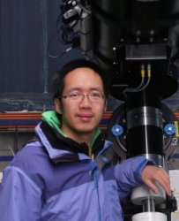

## Hi there!

### My name is Quanzhi, you can just call me QZ[[What is my name then?](#my-name)]. I am an astronomer at [Caltech](http://www.caltech.edu/)/[IPAC](http://www.ipac.caltech.edu/). I am mostly interested in the small stuff in our Solar System, namely asteroids, comets and meteoroids (which fathered meteors).

For the most part of my work, I use the [1.2-m Samuel Oschin telescope](http://www.astro.caltech.edu/palomar/about/telescopes/oschin.html) at [Palomar Observatory](http://www.astro.caltech.edu/palomar/homepage.html) to chase small asteroids that zip past our Earth, and to understand why and how comets get excited. I also use a range of worldwide facilities provided by the [GROWTH consortium](http://growth.caltech.edu/) to study these intriguing objects.

Outside my work, I enjoy going out for (non-work-related) stargazing. I also love play violin/viola/cello in orchestras and/or chamber music groups.

###### Photo by Hung-Chin Lin

 

* * *

 

## Education and Work Experience

<dl>
<dt>Postdoctoral Scholar ([GROWTH](http://growth.caltech.edu/) Fellow), 2016 - present</dt>
<dd>[California Institute of Technology](http://www.caltech.edu/)</dd>
<dt>Ph.D. in Astronomy, 2016</dt>
<dd>[University of Western Ontario](http://www.uwo.ca/)</dd>
<dd>Advisor: [Peter Brown](http://meteor.uwo.ca/~pbrown/)</dd>
<dd>Dissertation: [Aging Comets and Their Meteor Showers](http://ir.lib.uwo.ca/etd/3903/)</dd>
<dt>M.Sc. in Astronomy (Planetary Science), 2013</dt>
<dd>[University of Western Ontario](http://www.uwo.ca/)</dd>
<dt>B.Sc. in Atmospheric Sciences, 2010</dt>
<dd>[Sun Yat-sen University](http://www.sysu.edu.cn/)</dd>
</dl>

 

* * *

 

## Latest Papers

* Ye (2018): Meteor showers from active asteroids and dormant comets in near-Earth space: a review.
* Ye, Wiegert and Hui (2018): Finding Long Lost Lexell's Comet: The Fate of the First Discovered Near-Earth Object.
* Ye (2018): A Preliminary Analysis of the Shangri-La Bolide on 2017 Oct 4.
* Schwamb et al. (2018): Large Synoptic Survey Telescope Solar System Science Roadmap.
* Ye et al. (2017): 1I/2017 U1 (`Oumuamua) is Hot: Imaging, Spectroscopy and Search of Meteor Activity.

You can find a list of my publication on [NASA/ADS](http://adsabs.harvard.edu/cgi-bin/nph-abs_connect?library&libname=Ye%27s+Refereed+Publication&libid=57e6ba2680), [Google Scholar](https://scholar.google.com/citations?user=F-w70dYAAAAJ&hl=en) or [Research Gate](https://www.researchgate.net/profile/Quan_Zhi_Ye).

 

* * *

## Miscellaneous

* I am honored to receive the naming of asteroid (10280) Yequanzhi, discovered by Dr. Schelte J. "Bobby" Bus in 1981.
* I have had the fortune of discovering C/2007 N3 (Lulin), the naked-eye comet in 2009, with Mr. Chi Sheng Lin of Taiwan: gallery.
* A partial list of the asteroids that I have named
* Books translated (English to Chinese):
    * "Unraveling the Mysteries of The Big Bang Theory" by George Beahm [Amazon China]
    * "Wonders of the Universe" by Brian Cox [Amazon China]
* Guest blogs at the Planetary Society
* Research webpage of Xingming Observatory

#### My Name

> Different from the western naming order, Chinese names follow the surname-given name order. Hence, my name should be written as Ye Quanzhi, where Ye (pronounced as "Yeh") is my surname and Quanzhi (pronounced as Ch'üan Chih) is my given name.

> "Ye" means "leaf" in Chinese. The surname originated as a clan name after the [Duke of Ye](https://en.wikipedia.org/wiki/Duke_of_Ye), the Prime Minister of the State of Chu (today's lower Yangtze River area, including Shanghai) at about 500 BCE.

###### Last update: 2018 September 4