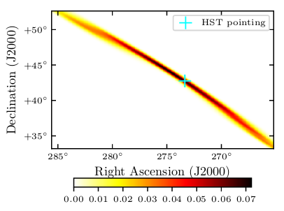
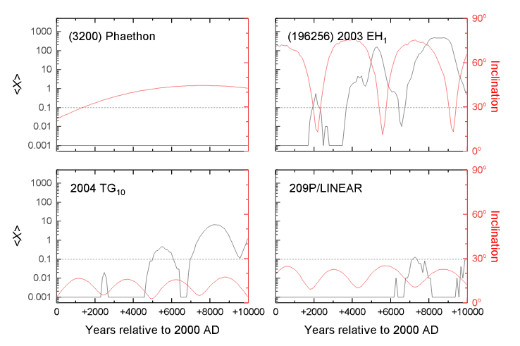
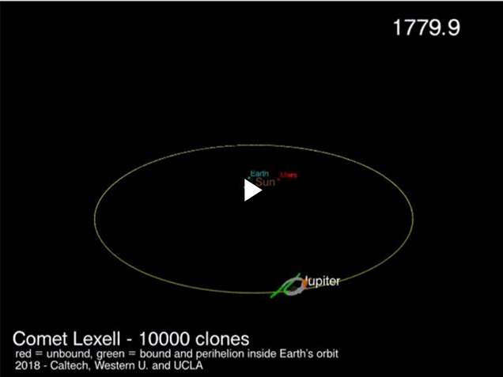
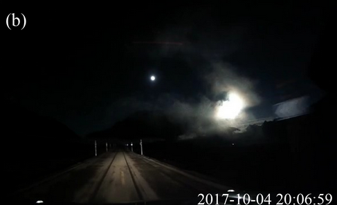

## Hi there!

### My name is Quanzhi, you can just call me QZ. I am an astronomer at [Caltech](http://www.caltech.edu/)/[IPAC](http://www.ipac.caltech.edu/). I am mostly interested in the small stuff in our Solar System, namely asteroids, comets and meteoroids (which fathered meteors).

For the most part of my work, I use the data collected by the [Zwicky Transient Facility (ZTF)](https://www.ztf.caltech.edu/) at [Palomar Observatory](http://www.astro.caltech.edu/palomar/homepage.html) to chase small asteroids that zip past our Earth, and to understand why and how comets get excited. I also use a range of worldwide facilities provided by the [GROWTH consortium](http://growth.caltech.edu/) to study these intriguing objects.

Outside of my work, I enjoy going out for (non-for-work) stargazing. I also love playing violin/viola/cello in music groups of variable sizes.

###### Photo by Hung-Chin Lin

 
* * *

## Education and Work Experience

* Postdoctoral Scholar ([GROWTH](http://growth.caltech.edu/) Fellow), [California Institute of Technology](http://www.caltech.edu/), 2016 - present
* Ph.D. in Astronomy, [University of Western Ontario](http://www.uwo.ca/), 2013 - 2016
    * Advisor: [Dr. Peter Brown](http://meteor.uwo.ca/~pbrown/)
    * Dissertation: [Aging Comets and Their Meteor Showers](http://ir.lib.uwo.ca/etd/3903/)
* M.Sc. in Astronomy, [University of Western Ontario](http://www.uwo.ca/), 2011 - 2013
* B.Sc. in Atmospheric Sciences, [Sun Yat-sen University](http://www.sysu.edu.cn/), 2006 - 2010

 
* * *

## Latest Research

Near-Earth Asteroid (3200) Phaethon is a mysterious object: it is associated with the strong Geminid meteor shower, implying that it had been highly active in the past, yet decades of observation showed that it is largely inactive. We used the Hubble Space Telescope to search for small fragments recently ejected from Phaethon. Although we found nothing, we concluded that Phaethon has likely not been very active in the recent decades. We also showed how to take an ugly photo with Hubble!

[Ye, Wiegert and Hui (2018), ApJL, 864, 9.](http://iopscience.iop.org/article/10.3847/2041-8213/aada46/meta)

 

 

I review the latest research regarding using meteor shower observations to enhance our understanding of active asteroids and dormant comets.

[Ye (2018), P&SS in press.](https://www.sciencedirect.com/science/article/pii/S0032063317304518)

 

We target a 250-year-old unresolved mystery! Lexell's Comet was found in 1770 and was then subsequently lost, where could it be? We used a wide range of 21th century techniques -- state-of-the-art orbit determination, computer simulation, as well as modern day astronomical observation to try to solve this puzzle. Well, even though we still don't know where Lexell's Comet is, we uncovered a number of interesting clues that help you decide how to put your money (in case you want to bet). Bottom line: this could be one of the largest Near-Earth Objects that we know, and chances are good that it is still around!

[Ye, Wiegert and Hui (2018), AJ, 155, 163.](http://iopscience.iop.org/article/10.3847/1538-3881/aab1f6/meta). See also: [AAS Nova post](https://aasnova.org/2018/08/22/has-anyone-found-a-lost-comet/); [astrobites post](https://astrobites.org/2018/04/02/long-lost-comet/)

 

It was the mid-autumn festival at the small city of Shangri-La in southwestern China, and people went outside for traditional moon-gazing event. Suddenly, a bright bolide appeared, loud booms were heard and the ground shaked for a couple seconds. It turned out that a small asteroid just collide with the Earth in the sky above Shangri-La. In this short research note, I briefly researched this event and calculated where surviving meteorites could have landed.

[Ye (2018), E&PP, 1, 170.](http://www.eppcgs.org/article/id/6f94c7b1-15ec-4656-8c40-1d70a8b6d936?pageType=en)

 

\`Oumuamua, found in October 2017, is the first known interstellar object that visited our Solar System. We joined the party that greet `Oumuamua with observations and papers. We measured the behavior and color of \`Oumuamua, and found that it is not a comet as people have predicted, but more closely resembles a rocky asteroid. We also tried to observe meteors originated from \`Oumuamua as an independent test to see if \`Oumuamua has recently been active, but also did not detect any.

[Ye, Zhang, Kelley and Brown (2017), ApJL, 851, 5.](http://iopscience.iop.org/article/10.3847/2041-8213/aa9a34/meta)

 You can find a list of my publication on [NASA/ADS](http://adsabs.harvard.edu/cgi-bin/nph-abs_connect?library&libname=Ye%27s+Refereed+Publication&libid=57e6ba2680), [Google Scholar](https://scholar.google.com/citations?user=F-w70dYAAAAJ&hl=en) or [Research Gate](https://www.researchgate.net/profile/Quan_Zhi_Ye).

 
* * *

## Outreach

In addition to research, I also love doing outreach. I have written many articles for magazines/blogs and given talks since high school, and still enjoy reaching out to the general public after earning my Ph.D. Most of my outreach work was done in my home country (China). Unsurprisingly, doing outreach in western countries is hugely different from what I have done in China! But I have since found my niche on promoting the communication between China and the West.

Some of my recent outreach works with connection to English-speaking audience:

* [Guest blogs at the Planetary Society, introducing recent Chinese space activities to the West](http://www.planetary.org/blogs/guest-blogs/?author_profile=325290428&topics=&dateType=firstPublicationDate&startDate=&endDate=)
* Appearance on [Spacepod #103: meteor showers and "broom stars" with Dr. Ye](https://www.listentospacepod.com/episodes/2017/7/16/103-meteor-showers-and-broom-stars-with-dr-ye)
* Appearance on [Astrotalk UK #75: China - back to the Moon with Chang'e 4](https://astrotalkuk.org/episode-75-china-back-to-the-moon-with-chang-e-4/)
    
If you are curious on how much less awkward (?) I am on Mandarin-speaking podcasts, here you go:

* [MounStar Talk Show #194: Geminid meteor shower](https://player.fm/series/series-106962/no194)
* [MounStar Talk Show #196: interstellar asteroid `Oumuamua](https://player.fm/series/series-106962/no196-oumuamua)

You can find me on [Twitter](https://twitter.com/Yeqzids) or [Weibo](https://www.weibo.com/1705147594) (Twitter-like service in China).

 
* * *

## Miscellaneous

* I am really happy to receive the naming of asteroid [(10280) Yequanzhi](https://ssd.jpl.nasa.gov/sbdb.cgi?sstr=10280;old=0;orb=1;cov=0;log=0;cad=0#orb), courtesy of [Dr. Schelte J. "Bobby" Bus](https://www.ifa.hawaii.edu/users/sjb/default/bus.shtml)! Thank you Bobby!
* I was very fortunate to have co-discovered [comet C/2007 N3 (Lulin)](https://en.wikipedia.org/wiki/Comet_Lulin), the naked-eye comet in 2009, with highly acclaimed Taiwanese astrophotographer Mr. Chi Sheng Lin: [Spaceweather.com gallery](http://www.spaceweather.com/comets/gallery_lulin.htm).
* [Research webpage of Xingming Observatory, an amateur-run remote observatory in China](http://www.astro.caltech.edu/~qye/xingming.html)

 
#### My Name

> Chinese names are written in surname-first order. Strictly speaking, this rule also applies to their English counterparts, even though in daily practice this rule has not been strictly observed. Hence, my name should really be written as Ye Quanzhi, where Ye (pronounced as "Yeh") is my surname and Quanzhi (pronounced as Ch'üan Chih) is my given name.

> "Ye" means "leaf" in Chinese. Ye is also romanized "Yeh", "Yip", "Ip" in different spelling systems and variety of spoken Chinese (e.g. Cantonese), and "She" in ancient Chinese. The surname originated as a clan name after the [Duke of Ye](https://en.wikipedia.org/wiki/Duke_of_Ye), the Prime Minister of the [State of Chu](https://en.wikipedia.org/wiki/Chu_(state)) (today's lower Yangtze River area, including Shanghai) at circa 500 BCE. Confucius visited the Duke of Ye in 489 BCE, and their conversations were recorded in [The Analects](https://ctext.org/analects/zi-lu). 

###### Last update: 2018 September 5