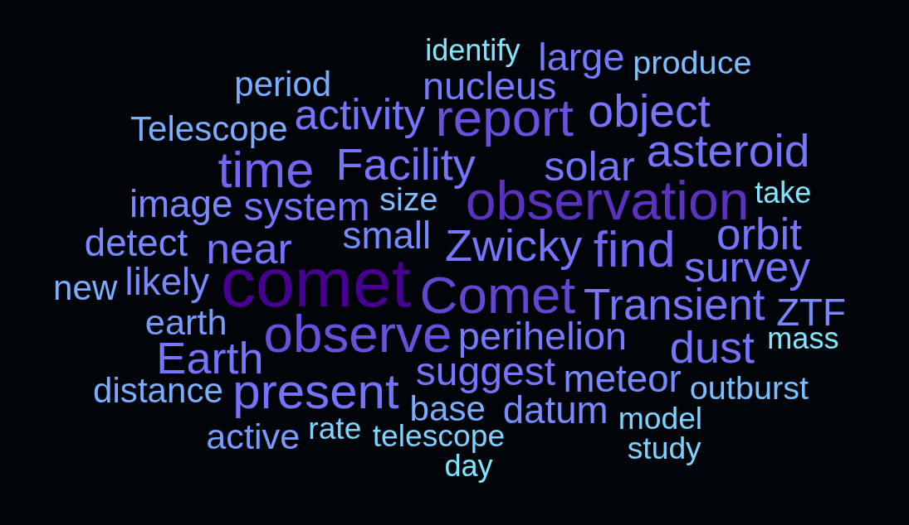
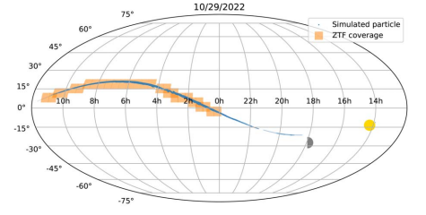
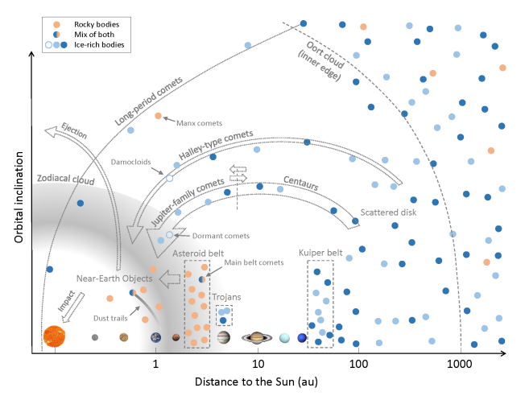
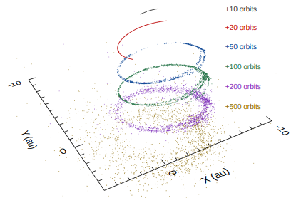
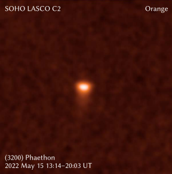

## Hi! I am Quanzhi (Ch'üan Chih).

I am a staff scientist of the [Near-Earth Object (NEO) Surveyor](https://science.nasa.gov/mission/neo-surveyor/) mission at the [Department of Earth, Planetary, and Space Sciences](https://epss.ucla.edu/) of [University of California, Los Angeles (UCLA)](https://www.ucla.edu/). Currently I am also an adjunct research scientist at the [Department of Astronomy](https://www.astro.umd.edu/) at [University of Maryland](https://www.umd.edu/) and a visiting researcher at the [Center for Space Physics](https://www.bu.edu/csp/) of [Boston University](http://www.bu.edu).

My research focuses on the small bodies of the Solar System -- asteroids, comets, meteoroids (interplanetary dust). These objects are primitive remnants of the Solar System's formation and preserve invaluable clues about the processes that shaped the planets. By studying them, we can better understand the formation and evolution of planetary systems, the delivery of water and organic materials to Earth, and the hazards posed by near-Earth objects (NEOs). They also provide important context for interpreting planetary systems around other stars.

My research combines observational, computational, and data-driven approaches. Much of my recent research focuses on data from the [Zwicky Transient Facility](https://www.ztf.caltech.edu/), an optical sky survey program operated at the [Palomar Observatory](https://sites.astro.caltech.edu/palomar/homepage.html) in California, using its unprecedented sky coverage to study asteroids and comets in our cosmic neighborhood. As part of the [NEO Surveyor](https://science.nasa.gov/mission/neo-surveyor/) mission, I contribute across a broad range of scientific and technical efforts to help maximize the mission's scientific return.

My fascination with the night sky began in childhood and continues today. Outside of work, I still enjoy spending an occasional evening doing stargazing. I also have a longstanding passion for music, and I play the violin, viola, and cello. Outside astronomy, I can often be found playing chamber music with friends. One of my favorite memories where these two passions joined was (casually) playing Bach's *Cello Suites* beneath the historic 200-inch Hale Telescope at Palomar Observatory.

[What's in my name?](#my-name)

 
* * *

## Education

* Ph.D. in Astronomy, [University of Western Ontario](http://www.uwo.ca/), 2016
    * Advisor: [Peter Brown](http://meteor.uwo.ca/~pbrown/)
    * Thesis: [Aging Comets and Their Meteor Showers](http://ir.lib.uwo.ca/etd/3903/)
* M.Sc. in Astronomy, [University of Western Ontario](http://www.uwo.ca/), 2013
* B.Sc. in Atmospheric Sciences, [Sun Yat-sen University](http://www.sysu.edu.cn/), 2010

 
* * *

## Professional Appointments

* NEO Surveyor Scientist, [Department of Earth, Planetary, and Space Sciences](https://epss.ucla.edu/), [UCLA](https://www.ucla.edu/), 2026 - present
* Research Scientist, [Department of Astronomy](https://www.astro.umd.edu), [University of Maryland](http://www.umd.edu), 2019 - 2024 (Assistant); 2024 - 2026 (Associate); 2026 - present (Associate/adjunct)
* Visiting Researcher, [Center for Space Physics](https://www.bu.edu/csp/), [Boston University](https://www.bu.edu/), 2022 - present
* Postdoctoral Scholar, [Caltech](http://www.caltech.edu/)/[IPAC](http://www.ipac.caltech.edu/), 2016 - 2019

 
* * *

## Honors and Awards

* 2023 [Harold C. Urey Prize in Planetary Science](https://dps.aas.org/prizes/urey)
* 2017 Minor planet [(10280) Yequanzhi](https://ssd.jpl.nasa.gov/sbdb.cgi?sstr=10280;old=0;orb=1;cov=0;log=0;cad=0#orb)
* 2007 Youth Science and Technology Innovation Award (China)

 
* * *

## Research

<object data="imgs/wordcloud.svg" type="image/svg+xml">
  
</object>

Keyword cloud generated using [SciX](https://ui.adsabs.harvard.edu/public-libraries/uWrrUyxARqG0pdFiOw3adg). For a list of my publications, please see [SciX](https://scixplorer.org/user/libraries/uWrrUyxARqG0pdFiOw3adg) or [Google Scholar](https://scholar.google.com/citations?user=do9dkJYAAAAJ).

 
### Recent Research

The Encke-Taurid Complex, comprising of Encke's Comet and the Taurid meteoroid stream, is thought to be the relics of a large-scale cometary breakup and may harbor a swarm of potentially Earth-threatening asteroids. The extent of this swarm, however, is uncertain due to the lack of observations. We used the mighty [Zwicky Transient Facility](https://www.ztf.caltech.edu/) to conduct a targeted search of such asteroids during their predicted close encounter to Earth in 2022. The analysis showed that there are no more than 9 to 14 hundred-meter-class asteroids in this swarm, or 10<sup2> Tunguska-sized objects, suggesting that the impact risk from these asteroids is relatively low.

[Li, Ye, Vida et al. (2025), PSJ, 6, 94](https://iopscience.iop.org/article/10.3847/PSJ/adbe74) .. [Press Release](https://cmns.umd.edu/news-events/news/new-study-eases-concerns-over-possible-doomsday-asteroid-swarm) | [Ye, Li, Vida et al. (2026), Acta Astronautica, 238, 285](https://scixplorer.org/abs/2026AcAau.238..285Y/abstract)

 

This chapter, entitled ``Minor planets, asteroids, comets and interplanetary dust within 30 au'', provides an up-to-date (as of late 2024) review of the research of small Solar System bodies (including meteoroids and interplanetary dust) within roughly the orbit of Neptune. The chapter is part of the <i>Encyclopedia of Astrophysics, 1st Edition</i> which aims to provide the first entry point for undergraduate and graduate students as well as early career researchers to the field. I try to include as much as nice and useful figures as I could!

[Ye (2025), Encyclopedia of Astrophysics](https://shop.elsevier.com/books/encyclopedia-of-astrophysics/mandel/978-0-443-21439-4) | [preprint](https://arxiv.org/pdf/2409.09540)

 

What do you want to know about the relationship between comets and meteor showers? In this review article, we talk about the development and current state of affairs of meteor science -- with a focus on its role as a tool to study comets. We also review the established parent body -- meteor shower linkages.

[Ye and Jenniskens (2024), Comets III, p. 799](https://uapress.arizona.edu/book/comets-iii) | [preprint](https://arxiv.org/abs/2209.10654)

 

(3200) Phaethon is a mysterious object: it is associated with the strong Geminid meteor shower, implying that it had been highly active in the past, yet decades of observation showed that it is largely inactive. Lead by my colleague [Qicheng Zhang](https://near.earth/qz/), we analyze 25 years of data collected by the Solar and Heliospheric Observatory (SOHO), a veteran spacecraft that can observe the near-Sun sky, and find that Phaethon's near-Sun activity is actually caused by sodium emission. In separate works, we used the mighty [Lowell Discovery Telescope](https://lowell.edu/research/research-facilities/4-3-meter-ldt/) to conduct one of the deepest searches for signs of Phaethon's activity as well as the Hubble Space Telescope to search for small fragments recently ejected from Phaethon.

[Zhang, Battams, Ye et al. (2023), PSJ, 4, 70](https://iopscience.iop.org/article/10.3847/PSJ/acc866) .. [Ye, Knight, Kelley et al. (2021), PSJ, 2, 23](https://iopscience.iop.org/article/10.3847/PSJ/abcc71) .. [Ye, Wiegert and Hui (2018), ApJL, 864, 9](http://iopscience.iop.org/article/10.3847/2041-8213/aada46/meta)

* * *

## Outreach

I enjoy talking to the media and public about my research and have been occasionally doing so in both Mandarin Chinese and English.

Some of my recent outreach works in English:

* [Guest blogs at the Planetary Society, introducing recent Chinese space activities to the West](http://www.planetary.org/blogs/guest-blogs/?author_profile=325290428&topics=&dateType=firstPublicationDate&startDate=&endDate=)
* Appearance on [Spacepod #103: meteor showers and "broom stars" with Dr. Ye](https://www.listentospacepod.com/episodes/2017/7/16/103-meteor-showers-and-broom-stars-with-dr-ye)
* Appearance on [Astrotalk UK #75: China - back to the Moon with Chang'e 4](https://astrotalkuk.org/episode-75-china-back-to-the-moon-with-chang-e-4/)
    
...and in Mandarin Chinese:

* [Mountain Star Talk Show #194: Geminid meteor shower](https://player.fm/series/series-106962/no194)
* [Mountain Star Talk Show #196: interstellar asteroid 'Oumuamua](https://player.fm/series/series-106962/no196-oumuamua)
* [Los Angeles Astronomy on Tap #65: Killer asteroids](https://youtu.be/Lne2-5EW7dI)

 
* * *

## Tools

* [MPEC Watch](https://sbnmpc.astro.umd.edu/mpecwatch/) -- statistical metrics and plots derived from Minor Planet Center's Minor Planet Electronic Circular service.
* [MPC Asteroid Name/Citation Search](https://sbnmpc.astro.umd.edu/mpcitations/index.shtml) -- a simple tool to search the naming citations of named minor planets.
* [7Timer!](https://www.7timer.info) -- a service that provides astronomy-oriented weather forecast for the next a couple of days.

 
### My Name

> The closest pronunciation of my name in English is **Yeh Ch'üan Chih**, though I won't mind if you call me Ch'üan Chih, "Qwuaan-Zee," or simply QZ. In the Chinese naming convention, the family name comes before the given name, so Ye is my family name and Quanzhi is my given name. In publications, however, I usually follow the Western convention and write my name as Quanzhi Ye.

> Chinese names often carry special meanings. My family name, Ye (叶 in simplified Chinese, 葉 in traditional Chinese), means "leaf." Depending on the romanization system or Chinese variety, it may also be spelled Yeh, Yip, or Ip, and in ancient Chinese it was pronounced She. The surname originated as the name of the ancient city of Ye and became associated with the descendants of the [Duke of Ye](https://en.wikipedia.org/wiki/Duke_of_Ye), a prominent statesman of the [State of Chu](https://en.wikipedia.org/wiki/Chu_(state)) during the 5th century BC. Confucius visited the Duke of Ye in 489 BC, and their conversation is recorded in [The Analects](https://ctext.org/analects/zi-lu). My given name is composed of Quan (泉), meaning "spring" or "source of water," and Zhi (志), meaning "aspiration" or "ambition." Together, the name conveys the idea of aspirations flowing continuously like spring water -- a subtle nod to my family name, since leaves, after all, need water.

###### Last update: 2026 July 22
