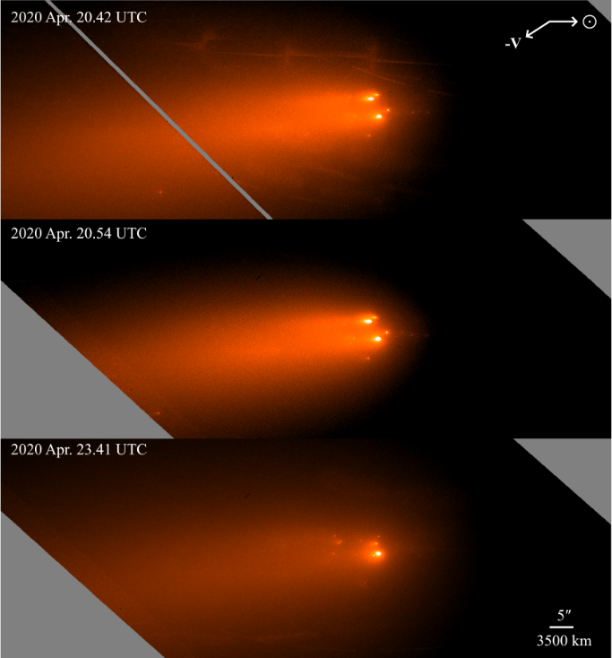

## Hi there!

### My name is Quanzhi Ye. I go by Quanzhi or QZ for short. I am a planetary astronomer at the [University of Maryland](http://www.umd.edu/).

I am primarily interested in the small bodies of the solar system -- namely asteroids, comets, and meteoroids. I use a wide range of techniques to study these intriguing bodies. I have used the [Canadian Meteor Orbit Radar](https://fireballs.ndc.nasa.gov/cmor-radiants/) to study meteor showers, as well as the [Zwicky Transient Facility (ZTF) project](https://www.ztf.caltech.edu/) at [Palomar Observatory](http://www.astro.caltech.edu/palomar/homepage.html) to find near-Earth asteroids and comets. I also help maintain the [NASA Planetary Data System Small Bodies Node](https://pds-smallbodies.astro.umd.edu/).

I was captivated by the stars when I was a child. Nowadays I still enjoy going out for stargazing every once in a while. Besides stars, I also like music. I play violin, viola and cello in various orchestras and string ensembles as I move from China to Canada and then the US. Most recently, I played viola and cello in Caltech's wonderful [Chamber Music program](http://chambermusic.caltech.edu/).

 
* * *

## Education

* Ph.D. in Astronomy, [University of Western Ontario](http://www.uwo.ca/), 2016
    * Advisor: [Peter Brown](http://meteor.uwo.ca/~pbrown/)
    * Thesis: [Aging Comets and Their Meteor Showers](http://ir.lib.uwo.ca/etd/3903/)
* M.Sc. in Astronomy, [University of Western Ontario](http://www.uwo.ca/), 2013
* B.Sc. in Atmospheric Sciences, [Sun Yat-sen University](http://www.sysu.edu.cn/), 2010

 
* * *

## Professional Appointments

* Assistant Research Scientist, [University of Maryland](http://www.umd.edu), 2019 - present
* Postdoctoral Scholar, [Caltech](http://www.caltech.edu/)/[IPAC](http://www.ipac.caltech.edu/), 2016 - 2019
* Graduate Teaching/Research Assistant, [University of Western Ontario](http://www.uwo.ca/), 2011 - 2016
* Research Fellow, [Sun Yat-sen University](http://www.sysu.edu.cn/) Atmospheric Exploration Laboratory, 2007 - 2011

 
* * *

## Research

The keyword cloud above is generated using [Scimeter](https://scimeter.org/) on 2021 April 19. You can find a list of my publication on [NASA/ADS](https://ui.adsabs.harvard.edu/public-libraries/uWrrUyxARqG0pdFiOw3adg) or [Google Scholar](https://scholar.google.com/citations?user=do9dkJYAAAAJ).

 
### Latest Research

Comet C/2019 Y4 (ATLAS) generated quite a bit of excitement when it once held the potential to be the "Comet of the Century" but eventually disrupted two months before reaching perihelion. Despite so, it is still an exciting object as it is the first member of a long-period comet group observed to disintegrate well before perihelion. We used the mighty [Hubble Space Telescope](https://www.nasa.gov/mission_pages/hubble/main/index.html) to observe the comet as it fell apart and found direct evidence of a non-uniform nucleus: one part of the comet is more fragile than the other; and additionally, the comet supposedly passed extremely close to the Sun during its last return but failed more than 4 times farther away from the Sun this time, which is very intriguing. In an earlier work, we discussed and confirmed the sibling relationship of C/2019 Y4 and a bright comet that appeared in the year of 1844.

[Ye, Jewitt, Hui et al. (2021), AJ, in press](https://arxiv.org/abs/2105.02269) [Hui and Ye (2020), AJ, 160, 91](https://iopscience.iop.org/article/10.3847/1538-3881/ab9d81/meta)

 

(3200) Phaethon is a mysterious object: it is associated with the strong Geminid meteor shower, implying that it had been highly active in the past, yet decades of observation showed that it is largely inactive. Using the mighty [Lowell Discovery Telescope](https://lowell.edu/research/research-facilities/4-3-meter-ldt/), we conducted one of the deepest searches for signs of Phaethon's activity. Although we did not find anything, we placed a stringent constraint on the upper limit of Phaethon's activity, which may help the forthcoming [DESTINY+ mission](https://destiny.isas.jaxa.jp/), set to launch to Phaethon in 2028. In a different paper, we also used the Hubble Space Telescope to search for small fragments recently ejected from Phaethon.

[Ye, Knight, Kelley et al. (2021), PSJ, 2, 23](https://iopscience.iop.org/article/10.3847/PSJ/abcc71) [Ye, Wiegert and Hui (2018), ApJL, 864, 9](http://iopscience.iop.org/article/10.3847/2041-8213/aada46/meta)

 

As the second anniversary of the discovery of 'Oumuamua was approaching, Ukrainian astronomer Gennadiy Borisov found the second interstellar object, and this time -- unlike 'Oumuamua -- it is an unambiguous comet. We look back in time and search for pre-discovery detections of 2I. We found not one -- not two -- but pre-discovery detections over six different epochs, with the earliest being almost 9 months before the discovery of 2I! These detections allow us to say something about the composition of 2I.

[Ye, Kelley, Bolin et al. (2020), AJ, 159, 77](https://iopscience.iop.org/article/10.3847/1538-3881/ab659b)

 

"Don't aim your telescope near the Sun," they say, but at Zwicky Transient Facility we gave it a try. Not during daytime of course, but during the brief twilight hours. The goal? Explore the innermost region in the solar system. By going about 10 degrees closer to the Sun than other surveys (and, of course, have to endure brighter background and sub-par image quality), we found two km-sized (large!) Interior-Earth Objects during our 7-month survey. We also unsuccessfully looked for Earth and Venus co-orbital asteroids, asteroids that share the same orbit with Earth/Venus.

[Ye, Masci, Ip et al. (2020), AJ, 159, 70](https://iopscience.iop.org/article/10.3847/1538-3881/ab629c)

 

How can the smallest (known) comet generates one of the largest (known) comet outbursts? We are curious too. Here comes comet 289P/Blanpain, a comet that was lost shortly after its discovery in 1819, only to be rediscovered 200 years later as a weakly-active comet that is only 300-m in size, the smallest comet ever known. It suddenly brightened by a factor of 1,000 in 2013, with a broad, short tail. We found that its sudden reappearance in 2013 was caused by a mega-outburst that released 100 thousand tons of dust, that is (a bit surpisingly) only 1% of its total mass. We proposed that this outburst was triggered by the crystallization of amorphous water ice. Bonus: 289P is returning at the end of 2019! Whether it will reemerge as a healthy comet or disappear entirely is beyond anybody's guess.

[Ye and Clark (2019), ApJL, 878, 2](https://iopscience.iop.org/article/10.3847/2041-8213/ab26bc/meta)

 

.

What happen to the asteroids that get too close to the Sun? Previous studies suggest that they explode -- but we don't know how they explode, because we have never seen one. But there are other ways to probe this process: the disrupted asteroids produce dust streams on their orbits that, if intersect the Earth's orbit, could be visible as meteor showers. Here we use dynamical model and meteor observations to study the explosion of near-Sun asteroids. We find that such "explosions" probably happen in slow-motion -- they may take a few thousand years to complete. We also made an educated guess that some of the near-Sun "comets" might, in fact, be exploding (or, to use a better word, "disintegrating") asteroids.

[Ye and Granvik (2019), ApJ, 873, 104](https://iopscience.iop.org/article/10.3847/1538-4357/ab05ba/meta)

 

* * *

## Outreach

I enjoy talking to the public about my research. I have written over 50 articles for popular science and have given over 80 public talks since 2004. Most of my outreach work was done in China and/or in Chinese/Mandarin. But whenever I got a chance, I make an effort of going out of my comfort zone and speak to the audience/journalists in the US!

Some of my recent outreach work in English:

* [Guest blogs at the Planetary Society, introducing recent Chinese space activities to the West](http://www.planetary.org/blogs/guest-blogs/?author_profile=325290428&topics=&dateType=firstPublicationDate&startDate=&endDate=)
* Appearance on [Spacepod #103: meteor showers and "broom stars" with Dr. Ye](https://www.listentospacepod.com/episodes/2017/7/16/103-meteor-showers-and-broom-stars-with-dr-ye)
* Appearance on [Astrotalk UK #75: China - back to the Moon with Chang'e 4](https://astrotalkuk.org/episode-75-china-back-to-the-moon-with-chang-e-4/)
    
If you are curious, here are some of my Mandarin-speaking podcasts:

* [Mountain Star Talk Show #194: Geminid meteor shower](https://player.fm/series/series-106962/no194)
* [Mountain Star Talk Show #196: interstellar asteroid 'Oumuamua](https://player.fm/series/series-106962/no196-oumuamua)
* [Astronomy on Tap (Mandarin) #1: Killer asteroids](https://www.caltech.edu/campus-life-events/master-calendar/astronomy-on-tap-90098)

You can find me on [Twitter](https://twitter.com/Yeqzids) or [Weibo](https://www.weibo.com/1705147594) (Twitter-like service in China).

 
* * *

## Tools

* [7Timer!](https://www.7timer.info) -- a service that provides astronomy-oriented weather forecast for the next a couple of days.

 
* * *

## Miscellaneous

* I am priviledged to be named after asteroid [(10280) Yequanzhi](https://ssd.jpl.nasa.gov/sbdb.cgi?sstr=10280;old=0;orb=1;cov=0;log=0;cad=0#orb).
* I have co-discovered [comet C/2007 N3 (Lulin)](https://en.wikipedia.org/wiki/Comet_Lulin), the naked-eye comet in 2009, with acclaimed Taiwanese astrophotographer Chi Sheng Lin: [Spaceweather.com gallery](http://www.spaceweather.com/comets/gallery_lulin.htm). I have since discovered three more comets, C/2019 J2 (Palomar), C/2019 K4 (Ye) and P/2019 LM4 (Palomar). I have also found 11 comets in the [images taken by SOHO spacecraft](https://sungrazer.nrl.navy.mil/) back in 2005--2006.

 
### My Name

> Chinese names start with the family name followed by the first name, though most Chinese in the West follow the general Western order and put their first name first. This includes the author list in most publication. Hence, even though my name is listed as Quanzhi Ye in most of my papers, it should really be spelled as Ye Quanzhi, where Ye (pronounced as "Yeh") is my family name and Quanzhi (pronounced as Ch'üan Chih, but I am okay with whatever pronounciation convenient to people) is my given name.

> "Ye" (叶 in simplified Chinese, 葉 in traditional Chinese) means "leaf" in Chinese. Ye is also romanized "Yeh", "Yip", "Ip" in different spelling systems and variety of spoken Chinese (e.g. Cantonese), and "She" in ancient Chinese. The surname originated as a clan name after the [Duke of Ye](https://en.wikipedia.org/wiki/Duke_of_Ye), the Prime Minister of the [State of Chu](https://en.wikipedia.org/wiki/Chu_(state)) at circa 500 BCE. Confucius visited the Duke of Ye (She) in 489 BCE, and their conversations were recorded in [The Analects](https://ctext.org/analects/zi-lu). If you wonder, "Quan"/泉 means spring (source of water), and "Zhi"/志 means aspiration, so my first name means something along the lines of a source of ample aspiration that runs like spring water, with some reference to my surname since leaves need water.

###### Last update: 2021 June 10
