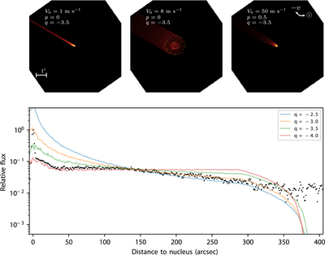

## Hi there!

### My name is Quanzhi, you can call me QZ. I am an astronomer at the [University of Maryland](http://www.umd.edu/).

I am primarily interested in the small bodies of the solar system -- namely asteroids, comets, and meteoroids. I use a wide range of techniques to study these intriguing bodies. I have used the [Canadian Meteor Orbit Radar](https://fireballs.ndc.nasa.gov/cmor-radiants/) to study meteor showers, as well as the [Zwicky Transient Facility (ZTF) project](https://www.ztf.caltech.edu/) at [Palomar Observatory](http://www.astro.caltech.edu/palomar/homepage.html) to find near-Earth asteroids and comets. I also help maintain the [Small Body Node of the NASA Planetary Data System](https://pds-smallbodies.astro.umd.edu/).

I was captivated by the stars when I was a kid. Nowadays I still enjoy going out for stargazing in my spare time. Besides stars, I also have a passion for music. I have played violin, viola and cello in various orchestras and string ensembles as I moved from China to Canada and then the US. Most recently, I played viola and cello in Caltech's wonderful [Chamber Music program](http://chambermusic.caltech.edu/).

 
* * *

## Education

* Ph.D. in Astronomy, [University of Western Ontario](http://www.uwo.ca/), 2016
    * Advisor: [Peter Brown](http://meteor.uwo.ca/~pbrown/)
    * Thesis: [Aging Comets and Their Meteor Showers](http://ir.lib.uwo.ca/etd/3903/)
* M.Sc. in Astronomy, [University of Western Ontario](http://www.uwo.ca/), 2013
* B.Sc. in Atmospheric Sciences, [Sun Yat-sen University](http://www.sysu.edu.cn/), 2010

 
* * *

## Professional Appointments

* Visiting Assistant Research Scientist, [University of Maryland](http://www.umd.edu), 2019 - present
* Postdoctoral Scholar, [Caltech](http://www.caltech.edu/)/[IPAC](http://www.ipac.caltech.edu/), 2016 - 2019
* Graduate Teaching/Research Assistant, [University of Western Ontario](http://www.uwo.ca/), 2011 - 2016
* Research Fellow, [Sun Yat-sen University](http://www.sysu.edu.cn/) Atmospheric Exploration Laboratory, 2007 - 2011

 
* * *

## Research

The keyword cloud above is generated using [Scimeter](https://scimeter.org/) on 2019 December 20. You can find a list of my publication on [NASA/ADS](https://ui.adsabs.harvard.edu/public-libraries/uWrrUyxARqG0pdFiOw3adg) or [Google Scholar](https://scholar.google.com/citations?user=do9dkJYAAAAJ).

 
### Latest Research

"Don't aim your telescope near the Sun," they say, but at Zwicky Transient Facility we gave it a try. Not during daytime of course, but during the brief twilight hours. The goal? Explore the innermost region in the solar system. By going about 10 degrees closer to the Sun than other surveys (and, of course, have to endure brighter background and sub-par image quality), we found two km-sized (large!) Interior-Earth Objects during our 7-month survey. We also unsuccessfully looked for Earth and Venus co-orbital asteroids, asteroids that share the same orbit with Earth/Venus.

[Ye, Masci, Ip et al., AJ in press](https://arxiv.org/abs/1912.06109)

 

As the second anniversary of the discovery of 'Oumuamua was approaching, Ukrainian astronomer Gennadiy Borisov found the second interstellar object, and this time -- unlike 'Oumuamua -- it is an unambiguous comet. We look back in time and search for pre-discovery detections of 2I. We found not one -- not two -- but pre-discovery detections over six different epochs, with the earliest being almost 9 months before the discovery of 2I! These detections allow us to say something about the composition of 2I.

[Ye, Kelley, Bolin et al., AJ in press](https://arxiv.org/abs/1911.05902)

 

How can the smallest (known) comet generates one of the largest (known) comet outbursts? We are curious too. Here comes comet 289P/Blanpain, a comet that was lost shortly after its discovery in 1819, only to be rediscovered 200 years later as a weakly-active comet that is only 300-m in size, the smallest comet ever known. It suddenly brightened by a factor of 1,000 in 2013, with a broad, short tail. We found that its sudden reappearance in 2013 was caused by a mega-outburst that released 100 thousand tons of dust, that is (a bit surpisingly) only 1% of its total mass. We proposed that this outburst was triggered by the crystallization of amorphous water ice. Bonus: 289P is returning at the end of 2019! Whether it will reemerge as a healthy comet or disappear entirely is beyond anybody's guess.

[Ye and Clark (2019), ApJL, 878, 2](https://iopscience.iop.org/article/10.3847/2041-8213/ab26bc/meta)

 

(6478) Gault, a main-belt asteroid, suddenly sprouted two tails in late 2018 to early 2019. Of course we immediately went into action! Using ZTF data we were able to determine the exact date of the onset of the activity as well as the amount and properties of material that it released (make sure you check out the time lapse of Gault made using ZTF data). Based on available evidence, we concluded that the activity of Gault was probably caused by rotational instability or binary merging -- that is, either Gault was spinning so fast that dust on its surface was thrown into space, or Gault had two components that were rubbing against each other.

[Ye, Kelley, Bodewits et al. (2019), ApJL, 874, 16](https://iopscience.iop.org/journal/1538-3873/page/Zwicky-Transient-Facility)

 

.

What happen to the asteroids that get too close to the Sun? Previous studies suggest that they explode -- but we don't know how they explode, because we have never seen one. But there are other ways to probe this process: the disrupted asteroids produce dust streams on their orbits that, if intersect the Earth's orbit, could be visible as meteor showers. Here we use dynamical model and meteor observations to study the explosion of near-Sun asteroids. We find that such "explosions" probably happen in slow-motion -- they may take a few thousand years to complete. We also made an educated guess that some of the near-Sun "comets" might, in fact, be exploding (or, to use a better word, "disintegrating") asteroids.

[Ye and Granvik (2019), ApJ, 873, 104](https://iopscience.iop.org/article/10.3847/1538-4357/ab05ba/meta)

 

* * *

## Outreach

In addition to research, I also love doing outreach. I have written many articles for magazines/blogs and have delivered over 80 talks since 2004. Most of my outreach work was done in my home country (China). Unsurprisingly, I find doing outreach in western countries hugely different from what I have done in China! But I have since found my niche on bridging the science-loving communities between China and the West.

Some of my recent outreach works with connection to English-speaking audience:

* [Guest blogs at the Planetary Society, introducing recent Chinese space activities to the West](http://www.planetary.org/blogs/guest-blogs/?author_profile=325290428&topics=&dateType=firstPublicationDate&startDate=&endDate=)
* Appearance on [Spacepod #103: meteor showers and "broom stars" with Dr. Ye](https://www.listentospacepod.com/episodes/2017/7/16/103-meteor-showers-and-broom-stars-with-dr-ye)
* Appearance on [Astrotalk UK #75: China - back to the Moon with Chang'e 4](https://astrotalkuk.org/episode-75-china-back-to-the-moon-with-chang-e-4/)
    
If you are curious, here are some Mandarin-speaking podcasts that I have contributed:

* [Mountain Star Talk Show #194: Geminid meteor shower](https://player.fm/series/series-106962/no194)
* [Mountain Star Talk Show #196: interstellar asteroid 'Oumuamua](https://player.fm/series/series-106962/no196-oumuamua)

You can find me on [Twitter](https://twitter.com/Yeqzids) or [Weibo](https://www.weibo.com/1705147594) (Twitter-like service in China).

 
* * *

## Miscellaneous

* I am honored to be named after minor planet [(10280) Yequanzhi](https://ssd.jpl.nasa.gov/sbdb.cgi?sstr=10280;old=0;orb=1;cov=0;log=0;cad=0#orb).
* I was fortunate to have co-discovered [comet C/2007 N3 (Lulin)](https://en.wikipedia.org/wiki/Comet_Lulin), the naked-eye comet in 2009, with acclaimed Taiwanese astrophotographer Chi Sheng Lin: [Spaceweather.com gallery](http://www.spaceweather.com/comets/gallery_lulin.htm). I have since discovered two more comets, C/2019 J2 (Palomar) and C/2019 K4 (Ye).

 
### My Name

> Chinese names are written in surname-first order. Strictly speaking, this rule also applies to their English counterparts, even though in daily practice this rule has not been strictly followed. Hence, my name should really be written as Ye Quanzhi, where Ye (pronounced as "Yeh") is my surname and Quanzhi (pronounced as Ch'üan Chih) is my given name.

> "Ye" (叶 in simplified Chinese, 葉 in traditional Chinese) means "leaf" in Chinese. Ye is also romanized "Yeh", "Yip", "Ip" in different spelling systems and variety of spoken Chinese (e.g. Cantonese), and "She" in ancient Chinese. The surname originated as a clan name after the [Duke of Ye](https://en.wikipedia.org/wiki/Duke_of_Ye), the Prime Minister of the [State of Chu](https://en.wikipedia.org/wiki/Chu_(state)) at circa 500 BCE. Confucius visited the Duke of Ye (She) in 489 BCE, and their conversations were recorded in [The Analects](https://ctext.org/analects/zi-lu). Since you asked, "Quan"/泉 means spring (source of water), and "Zhi"/志 means aspiration, so my first name means something along the lines of a source of ample aspiration that runs like spring water, with some reference to my surname since leaves need water.

###### Last update: 2019 December 20
